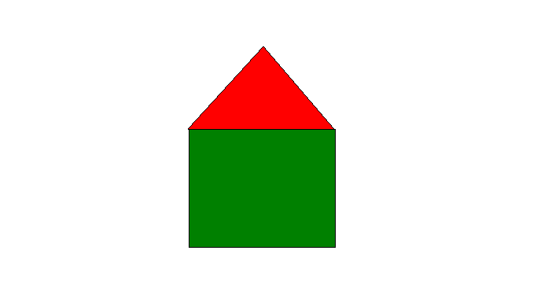

# **opengl_template**

## **IMPORTANT**

Tested only in Linux!

## **Used tools**

* GCC (10.2.0)
* CMake (3.16.3)
* Ninja (1.10.0)

## **Operational System**

* Ubuntu (20.10)| Kernel 5.8.0-7642-generic

## **Running**

Almost everything is automated just by running `./run`. To more info, read the script

Add a `show_fps` to show this infos about the app. E.g `./run show_fps`

## Show exercises

Press key to show guide

| Exercise | Hide | Show |   |   |
|----------|------|------|---|---|
| 1        | Q    | A    |   |   |
| 2        | W    | S    |   |   |
| 3)a      | E    | D    |   |   |
| 3)b      | R    | F    |   |   |
| 4        | T    | G    |   |   |
| 5        | Y    | H    |   |   |
| 7        | U    | J    |   |   |

## Ex - 7 -- Draw picture

